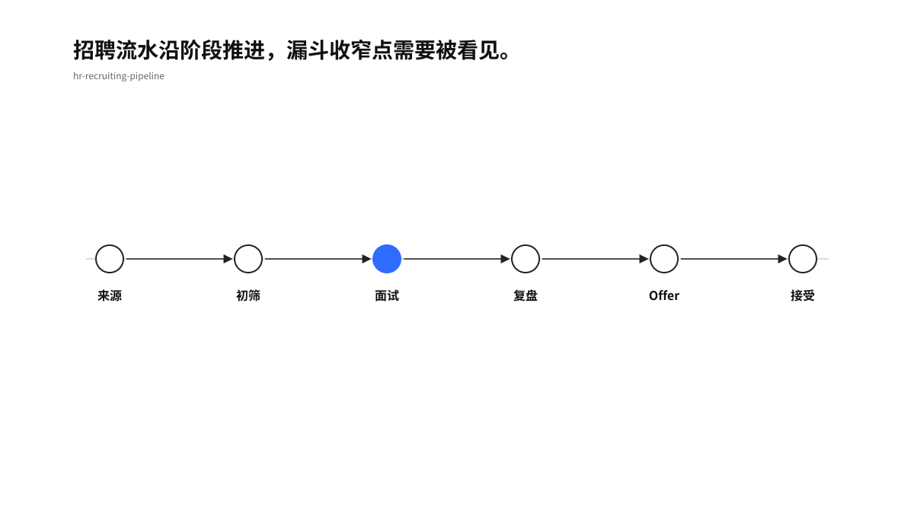
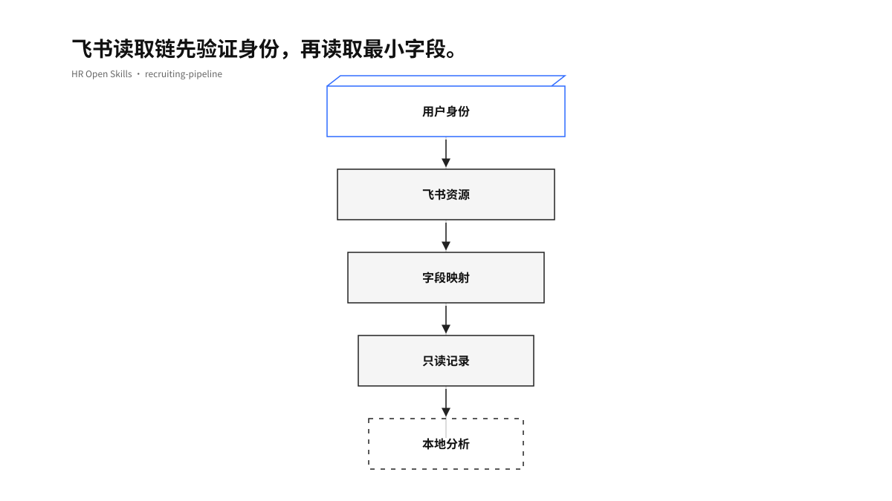
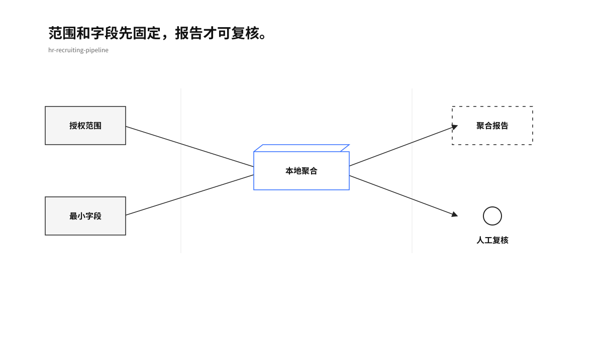
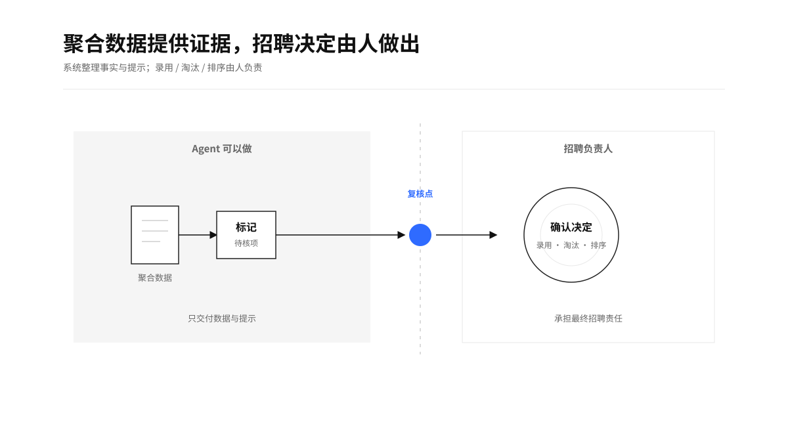

> “Skills encode the domain expertise, best practices, and step-by-step workflows Claude needs to give you useful help.” — [Anthropic Knowledge Work Plugins](https://github.com/anthropics/knowledge-work-plugins)

# hr-recruiting-pipeline

一个可复核、可本地运行、适配飞书的中文招聘流水 Skill。

## 先看懂它

招聘数据先经过身份校验和字段映射，再进入本地聚合，最后输出阶段分布、转换率、时长和来源效果。默认只读，候选人级别的录用、淘汰与排序留给人工判断。

<p align="center">
  
</p>

## 这个 Skill

### `hr-recruiting-pipeline`

适用于招聘进展、候选人流水、面试阶段、Offer 进展和招聘漏斗分析。输入可以来自用户明确授权的飞书 Base、Sheets，或脱敏 JSON/CSV。

核心输出包括：

- 主阶段人数与占比：Sourced、Screen、Interview、Debrief、Offer、Accepted。
- 相邻阶段转换率、阶段中位停留时长和完整招聘周期。
- 按渠道统计候选人数、到达面试人数、接受 Offer 人数和接受率。
- 缺失字段、未知阶段、异常日期、重复编号和历史记录完整度。

## 工作方式

先确认“谁授权、读什么、看哪段时间”，再读取最小字段集。飞书 CLI 负责读取，分析脚本留在本地，结果只输出聚合数据和质量提示。

<p align="center">
  
</p>

快速检查身份：

```bash
lark-cli auth status --json --verify
```

读取 Base 字段与记录：

```bash
lark-cli base +url-resolve \
  --url "https://example.feishu.cn/base/appXXXX?table=tblXXXX" \
  --as user --json

lark-cli base +field-list \
  --base-token "appXXXX" --table-id "tblXXXX" \
  --as user --json

lark-cli base +record-list \
  --base-token "appXXXX" --table-id "tblXXXX" \
  --limit 200 --as user --json
```

读取 Sheets：

```bash
lark-cli sheets +cells-get \
  --url "https://example.feishu.cn/sheets/shtXXXX" \
  --sheet-name "招聘流水" --range "A1:Z200" \
  --include value,formula --as user --json
```

本地聚合：

```bash
python3 scripts/analyze_pipeline.py \
  --input tests/fixtures/pipeline.json \
  --format markdown \
  --as-of 2026-08-12
```

## 数据如何变成结论

脚本保留三层证据：输入范围、规则计算、人工解释。它可以告诉你漏斗在哪一阶段变窄、哪个渠道样本达到面试或接受 Offer；它不会替招聘负责人决定谁该录用或淘汰。

<p align="center">
  
</p>

## 安全边界

- 默认使用 `--as user`，先确认 `identity=user` 与 `verified=true`。
- 默认只读，不更新候选人阶段、不发送消息、不创建面试、不发 Offer。
- 原始候选人数据不进入仓库、不上传外部服务、不写回飞书。
- 报告不输出姓名、邮箱、电话、简历正文等直接识别信息。
- 候选人排序、淘汰、录用、薪酬判断需要人工复核和明确规则。

<p align="center">
  
</p>

详细边界见 [Skill 说明](SKILL.md)、[飞书 CLI 适配](references/feishu-cli.md) 和 [安全说明](references/safety-boundaries.md)。

## 验证

在仓库根目录运行：

```bash
python3 -m unittest discover -s tests -p 'test_*.py'
python3 /Users/bytedance/.codex/skills/.system/skill-creator/scripts/quick_validate.py .
```

当前假数据测试覆盖阶段归一、转换、招聘周期、来源效果和候选人编号脱敏。飞书命令可用占位符执行 `--dry-run`，不会访问真实数据。

## 上游与许可证

本项目以 [Anthropic Human Resources Plugin](https://github.com/anthropics/knowledge-work-plugins/tree/658e077ffd7bdd50a12c19ec5ff36fe34c88be8a/human-resources) 的 `recruiting-pipeline` 为上游参考。固定版本和差异记录在 [UPSTREAM.md](UPSTREAM.md)，项目保留 Apache License 2.0 文本，见 [许可证](LICENSE-APACHE-2.0)。

中文说明、飞书适配、本地聚合脚本和测试属于本项目新增内容。本项目暂不代表 Anthropic 官方维护或背书。
